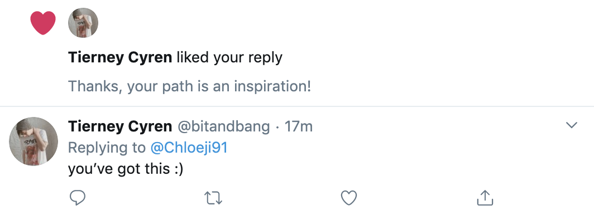

---
layout: post
title:  "a love letter to programming souls"
date:   2020-02-15 04:28:53 +0800
categories: life
tags: programming
image: idea.png
# applause: true
short_description: My emotions save here!
--- 

I have been active since this year, for I want to get involved in community. The place I came from.  

I came from learning programming is currently a lot of mates called <strong>'self taught'</strong>, yes I was and I am still. But I'm not learning from nothing, I'm learning with my full efforts, sometimes I need to stay up the whole night to stuck in somewhere, sometimes I need work 16 hours a day and the whole weekend.... but <strong>"it's hard to go alone" </strong> and it's impossible that I can learn totally by myself. What I learnt is from community, from stack overflow, the smart people from virtual world, and currently I tried to contribute to open source project, to make some pull/merge. 

So I'm working on it. What drives me emotionally is one tweets reply, "you've got this :)". 

I'm blessed and so content when hearing this. I know this is always the reason that let me stay in this field, for I have met and talked to so much kind people from this world, which make me want to to be one of them!! 

It's a long way but so pleasure to meet/virtually meet many nice beings, which we understand sharing is loving, really doing the work to make the world more love with tech. Love this world enough, just for this reason! 

